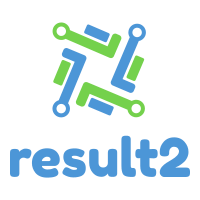

The .NET library for communicating results.

## Getting started
TODO

## Contributing

Check out the [contributing page](CONTRIBUTING.md) to see the best ways to contribute to result2.

## Code of conduct

See the [Code of Conduct](CODE_OF_CONDUCT.md) for the best ways to interact with this project.

## License

This project is licensed under the [MIT License](LICENSE).
